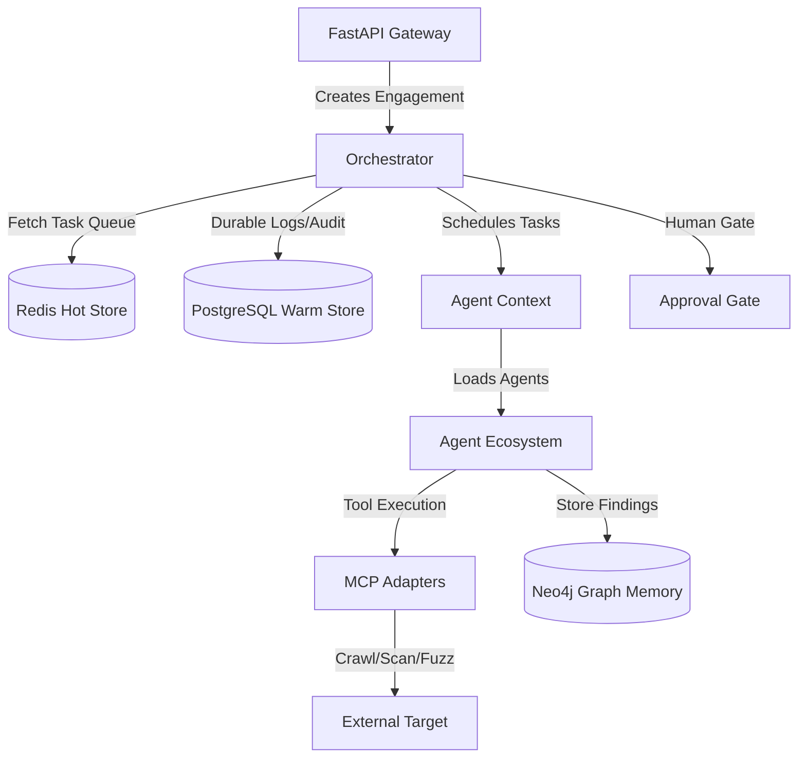

# Repository Guidelines

## Project Overview

The AI Offensive Security Orchestration Platform (AI-OSOP) is a multi-agent system designed for automated vulnerability discovery, differential authorization testing, and exploit validation. It coordinates task execution across specialized agents (such as Recon, VulnAnalysis, ExploitValidation, etc.) connected to local stateful databases and external tools integrated via the Model Context Protocol (MCP). The platform maintains a global attack graph, implements custom sandbox isolation, and enforces human-in-the-loop approval gates.

---

## Architecture & Data Flow

AI-OSOP is structured as a phase-enforced multi-agent network that handles tasks concurrently, records security telemetry, and enforces boundary constraints.



### Core Architecture Components

1. **API Gateway (FastAPI)**: Serves as the operator control center, exposing REST endpoints and WebSockets for real-time task streams. Its `lifespan` context manager handles startup connectivity checks (with backoffs) and hooks all database engines.
2. **Orchestrator**: Executes a central task consumer loop. Tasks are loaded from a Redis sorted set queue sorted by `Task.priority` (1-10). It enforces engagement phase transitions defined in `Orchestrator.VALID_TRANSITIONS` across the following phases:
   `initialized` $\rightarrow$ `reconnaissance` $\rightarrow$ `vulnerability_discovery` $\rightarrow$ `exploitation` $\rightarrow$ `post_exploitation` $\rightarrow$ `reporting` $\rightarrow$ `completed` / `halted`.
3. **Agent Ecosystem**: Extension of `BaseAgent` exposing background task workers. Active agents are registered on startup. The orchestrator uses in-memory locking to prevent concurrent access to the same agent instance.
4. **Multi-Tier Memory Tiers**:
   - **Hot Tier (Redis)**: Stores task queues (`queue:tasks:{engagement_id}`), session keys, heartbeats, and Dead Letter Queue (DLQ) buffers.
   - **Warm Tier (PostgreSQL + pgvector)**: Stores relational entity tables, vector embeddings for similarity-based lookups, and session audit trails.
   - **Graph Tier (Neo4j)**: Maps security relationship nodes modeling attack paths:
     `(:Asset)-[:HAS_ENDPOINT]->(:Endpoint)-[:HAS_VULNERABILITY]->(:Vulnerability)-[:EXPLOITED_BY]->(:Exploit)`.
5. **Temporal Orchestrator**: Toggleable workflow coordinator (via `OSOP_TEMPORAL_ENABLED`) enabling durable distributed workflow tracking.

---

## Key Directories

*   **`src/ai_osop/core/`**: Shared core configs (`config.py`), domain entities (`models.py`), custom exceptions (`exceptions.py`), metrics, and observability.
*   **`src/ai_osop/api/`**: FastAPI routers, middleware, and dependency injection parameters (`deps.py`).
*   **`src/ai_osop/orchestrator/`**: Tasks schedulers, coordination buses, and workflow workers.
*   **`src/ai_osop/agents/`**: Core and experimental agents (e.g. `ReconAgent`, `VulnAnalysisAgent`, `CodeQLAgent`, `GraphQLAgent`).
*   **`src/ai_osop/memory/`**: Adapters for Redis, Postgres, and Neo4j databases, plus data retention worker engines.
*   **`src/ai_osop/safety/`**: Scope controllers, Docker sandbox managers, prompt sanitizers, and eBPF tracing/filtering generators.
*   **`src/ai_osop/auth/`**: Token verifiers, session clients, and browser session collectors.
*   **`src/ai_osop/adapters/`**: Model Context Protocol (MCP) server connectors linking the agents to execution tools.
*   **`src/ai_osop/payload_engine/`**: LLM payload builders, encoders, and evaluation helpers.
*   **`src/ai_osop/reliability/`**: Exponential backoff decorators and DLQ managers.
*   **`tests/`**: Unit, integration, and mocks for testing the application code.
*   **`ui/`**: Vite React single page application for the approval console.
*   **`scripts/`**: Subfolders containing operations, debug, chaos, and qualification testing utilities.
*   **`k8s/`**: High-availability Kubernetes configurations (HPA, PDB, resource quotas, and cron backups).

---

## Development Commands

### Installation & Build
```bash
# Install Python dependencies and CLI
poetry install

# Create environment config
cp .env.example .env

# Install UI dependencies
npm --prefix ui install

# Build production container image
docker build -t ai-osop:latest .
```

### Running Backing Infrastructure
```bash
# Spin up Neo4j, PostgreSQL, and Redis databases
docker-compose up -d neo4j postgres redis
```

### Execution
```bash
# Run API Gateway locally (port 8200)
poetry run uvicorn ai_osop.api.main:app --reload --port 8200

# Start Vite React UI Console (port 5173)
npm --prefix ui run dev

# Run Operator CLI Commands
poetry run ai-osop --help
```

### Code Verification & Quality Gates
```bash
# Auto-format code matching black specification
poetry run black src tests

# Sort imports matching black profile
poetry run isort src tests

# Lint Python code for style issues
poetry run flake8 src

# Strict static type check
poetry run mypy src
```

### Testing
```bash
# Run the complete test suite
poetry run pytest

# Run a specific test file
poetry run pytest tests/test_smoke.py

# Run a specific test with verbose output and no traceback truncation
poetry run pytest tests/test_smoke.py::test_settings_load_mcp_defaults -vv --tb=short

# Run tests without coverage evaluation (faster iteration)
poetry run pytest --no-cov
```

---

## Code Conventions & Common Patterns

### ID Prefix Patterns
All cross-component identifiers must be prefixed to denote their entity type:
*   `eng-` : Engagement Session State
*   `asset-` : Discovered Host/Asset
*   `ep-` / `endpoint-` : HTTP API Endpoint
*   `vuln-` : Discovered Vulnerability
*   `payload-` : Mutated Payload Template
*   `task-` : Enqueued/Scheduled Task
*   `apr-` : Human Operator Approval Request
*   `evt-` : System Audit Event Log
*   `dlq-` : Dead Letter Queue Entry

### Naming Conventions
*   `snake_case` for module filenames, variables, function signatures, and tests.
*   `PascalCase` for classes, models, and Enum definitions.
*   `UPPER_CASE` for global constant declarations.
*   Private class attributes or internal module functions **must** be prefixed with a single leading underscore (e.g. `_run_task_worker`).

### Type Annotation Style
*   All signatures **must** declare type annotations (`disallow_untyped_defs = true`).
*   Nullable references must use Pydantic/Python stdlib `Optional[T]` rather than `T | None`.
*   Group imports: standard library first $\rightarrow$ third-party modules $\rightarrow$ local packages, utilizing absolute paths (e.g., `from ai_osop.core.config import settings`).

### Error Handling Hierarchy
All custom errors must inherit from `OSOException` (defined in `core/exceptions.py`) and support passing an error message and optional context dictionaries:
$$\text{OSOException} \longrightarrow \begin{cases} 
\text{MCPException} & \text{(MCPConnectionError, MCPTimeoutError)} \\
\text{ScopeException} & \text{(OutOfScopeError, ScopeValidationError)} \\
\text{AgentException} & \text{(AgentTaskFailed, AgentHallucinationDetected)} \\
\text{SafetyException} & \text{(ApprovalDeniedError, SandboxEscapeDetected)} \\
\text{MemoryException} & \text{(GraphQueryError)} \\
\text{WorkflowException} & \text{(WorkflowTransitionError)}
\end{cases}$$
*Always* avoid bare `except:` statements. Intercept specific types and log context variables.

### Async & Concurrency
*   All I/O bound methods (DB access, HTTP client request, MCP calls) must be defined with `async def` and called with `await`.
*   **Orchestrator claim lock**: Before running an agent task, the agent must be claimed via `Orchestrator._busy_agents` in-memory lock.
*   **Clean Teardown**: Tasks must use `asyncio.wait(..., timeout=5.0)` or `asyncio.wait_for` to cancel execution loops on shutdown cleanly instead of blocking.
*   **Retries**: Use the `@with_retry` exponential backoff decorator for transient services.
*   **DLQ Routing**: Unrecoverable failures exceeding the maximum task retry limit must be caught and routed to the Dead Letter Queue.

### State & Configuration Management
*   **Pydantic Settings**: Configuration is declared via Pydantic `BaseSettings` classes in `core/config.py`. All variables utilize `validation_alias="OSOP_UPPER_CASE"` to read from the environment.
*   **SessionStore & Client**: Cookie rotations, header caches, and auth tokens are persisted inside `SessionStore`. The `SessionClient` wraps the HTTPX AsyncClient to inject active auth contexts.
*   **Differential Authorization Verification**: Auth validation checks require explicit resource ownership mapping comparing response payloads from vertical/horizontal privileges before reporting vulnerabilities to avoid false positives.

---

## Important Files

*   `src/ai_osop/api/main.py`: Main FastAPI entry point and system lifespan manager.
*   `src/ai_osop/cli.py`: Click CLI manager mapping operations console commands.
*   `src/ai_osop/core/config.py`: Core application settings, server defaults, and MCP mappings.
*   `src/ai_osop/core/models.py`: Shared platform Pydantic schemas.
*   `src/ai_osop/orchestrator/orchestrator.py`: Main loop orchestrator, task queues consumer, and phase guard rails.
*   `src/ai_osop/safety/scope.py`: Scope checker targets parser and Docker container manager.
*   `src/ai_osop/memory/session_memory.py`: Multi-tier storage connector linking Redis and PostgreSQL.
*   `src/ai_osop/memory/graph_memory.py`: Neo4j Cypher connector for mapping attack graphs.
*   `src/ai_osop/auth/api_inventory.py`: Parser converting HAR captures to API endpoints in GraphMemory.

---

## Runtime/Tooling Preferences

*   **Python**: Version `^3.11`
*   **Package Manager**: Poetry
*   **UI Runtime**: NodeJS & NPM (Vite React UI)
*   **Databases**: PostgreSQL (with pgvector), Redis (7-alpine), Neo4j (5.18-community, apoc plugin active), and Temporal (optional).
*   **Model Context Protocol (MCP) Servers**:
    *   *Critical (Port)*: `browser-mcp` (8091), `source-map-mcp` (8096), `cloud-mcp` (8097), `turbo-intruder-mcp` (8098), `nuclei-mcp` (8084).
    *   *Optional (Port)*: `burp-mcp` (8081), `recon-mcp` (8082), `payload-mcp` (8083), `shodan-mcp` (8085), `security-bridge` (8087), `threat-intel-mcp` (8086).
*   **LLM Model Registry**: Interfaced via `litellm`. Defaults to `gpt-4o` (primary) and `gpt-4o-mini` (fallback).
*   **Mocking Mode**: For development and testing loops, set `OSOP_MOCK_LLM=true` to redirect LLM completion calls to simulated mock templates.

---

## Testing & QA

AI-OSOP enforces strict verification gates at multiple development tiers:

1. **Unit & Integration Layer**
   - Located in the `tests/` directory.
   - Executed using `poetry run pytest`.
   - Async testing runs under `asyncio_mode = "auto"` in `pyproject.toml`.
   - Uses `unittest.mock` (`AsyncMock`, `MagicMock`, `patch`) to mock database connections and third-party API callbacks.

2. **Chaos Testing**
   - Located in `scripts/chaos/`.
   - Orchestrated via `poetry run python scripts/chaos/run_chaos.py`.
   - Triggers network drops, Redis process kills, Postgres failovers, and MCP crash loops, certifying resilient degradation.
   - Outputs verification summary to `CHAOS_CERTIFICATE.md`.

3. **Production Qualification Suite**
   - Located in `scripts/qualification/`.
   - Orchestrated via `poetry run python scripts/qualification/run_all.py`.
   - Runs integration suites evaluating API security (JWT validation, RBAC, algorithm check bypasses), reliability, multi-tenant resource isolation (`test_ownership.py`), and high-throughput serialization scaling (`test_scale.py`).
   - Runs `test_self_pentest.py` to launch simulated SQL injection and IDOR attacks against the live application.
   - Generates `PRODUCTION_READINESS_REPORT.md` (readiness score) and `RELEASE_CERTIFICATE.md` containing formatting, linting, and typecheck status.
