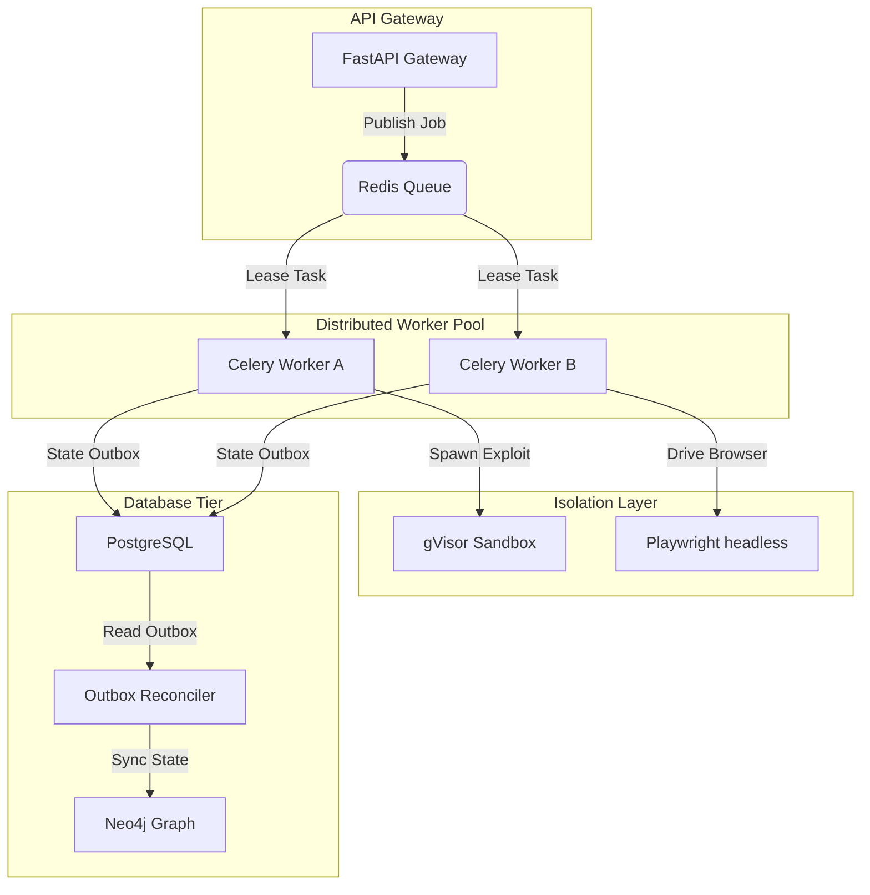

# AI-OSOP Version 2.0: SOTA Autonomous Offensive Security Architecture & Roadmap

This document presents a competitive comparison of AI-OSOP Version 1.0 against state-of-the-art (SOTA) autonomous offensive security frameworks, identifies the core structural capabilities missing from the current system, and details the architectural blueprint and implementation roadmap for **AI-OSOP Version 2.0**.

---

## 1. Competitive Capability Comparison

The table below contrasts the architecture and operational capabilities of **AI-OSOP V1.0** against SOTA autonomous security testing systems (e.g., DARPA Cyber Grand Challenge autonomous agents, commercial agentic security scanners, and Mayhem-style symbolic execution/fuzzing hybrids):

| Capability | SOTA Autonomous Frameworks | AI-OSOP V1.0 (Current) | Architectural Gaps |
| :--- | :--- | :--- | :--- |
| **Architecture** | Event-driven microservices; decoupled task queues (Temporal, Celery); dynamic container orchestrations. | Monolithic FastAPI process; in-process agent execution; local thread blocking. | Blocking API event loop; single-instance constraint; no process separation. |
| **Autonomy & Planning** | Hierarchical Goal-Oriented Action Planning (GOAP); dynamic execution graph mutations based on WAF feedback. | Linear phase transitions (Recon -> Vuln -> Exploit); static task queues. | No dynamic replanning; vulnerable to state stagnation when tasks fail. |
| **Orchestration** | Distributed actor-model workers; active-active clustering; global queue lease management. | Local thread scheduling; in-memory task dictionary; basic single-instance loops. | Single-point-of-failure; no multi-node safety; race conditions in task assignment. |
| **Reasoning** | Unified LLM-guided symbolic solvers; feedback-driven heuristic exploration. | Linear regex parsing of unstructured outputs; hardcoded decision trees. | High fragility to LLM formatting changes; no validation feedback loops. |
| **Graph Intelligence** | Multi-hop Graph Neural Networks (GNNs); automated pathfinding; relationship scoring. | Basic Neo4j query lookups; isolated vulnerability nodes; no exploit chaining. | No transitive vulnerability correlation; cosmetic schema warnings. |
| **Browser Automation** | Stateful trajectory recording; visual regression checks; session state recovery. | Basic Playwright commands; fragile browser bindings; blank screenshots on failure. | No stateful browser session recovery; no dynamic proxy routing. |
| **Memory & RAG** | Hybrid dense-sparse vector RAG; global knowledge graphs; cross-engagement intelligence. | Local Redis/Neo4j database states; no semantic knowledge indexing. | Missing historical recall; no cross-engagement learning. |
| **Extensibility** | Dynamically loaded WASM modules; standardized JSON-RPC schemas; hot-swappable plugins. | Hardcoded Python adapters; static configuration definitions. | Rigid tool registry; requires code modifications to add new scanners. |
| **Reporting** | Cryptographic provenance signing; temporal replay packages; compliance validation. | Static Markdown/HTML exports; blocked reporting loops. | No verification package signing; cannot export zero-finding reports cleanly. |
| **Engineering Quality** | Strict type annotations; decoupled domain boundaries (DDD); robust process supervision. | Pre-existing type mismatches; monolithic files; basic subprocess forks. | High technical debt; monolithic files; poor process isolation. |

---

## 2. Gaps & Missing Capabilities in AI-OSOP V1.0

1.  **Transitive Exploit Chaining:** V1.0 treats vulnerabilities as isolated, single-hop nodes. It cannot link a low-severity directory traversal on Server A with a local file read containing credentials, and then use those credentials to authenticate to Server B.
2.  **Adaptive Traffic Congestion Control:** Static bucket rate limits do not respond to network latency spikes or HTTP 429/403 blockages, leading to target service disruptions or WAF IP bans.
3.  **Durable Multi-Tenant State:** Task states and agent leases are tracked in-memory, causing total state loss during process restarts or crashes.
4.  **Isolated Execution Sandboxing:** The Docker execution environment is not locked down at the kernel level (such as via gVisor), exposing the host network and kernel to escape exploits.
5.  **Dynamic Service Discovery:** Fixed port mappings prevent concurrent execution of multiple engines, restricting the platform to a single target scan at a time.

---

## 3. AI-OSOP Version 2.0 Architectural Blueprint

AI-OSOP V2.0 shifts from a monolithic API to a **distributed, event-driven micro-agent architecture** designed to scale horizontally across multiple compute nodes.

### 3.1 Distributed Task Execution & Worker Pool
*   **Design:** Task scheduling is completely decoupled from the FastAPI web server. The API process only accepts inbound REST requests, validates payloads, and writes job declarations to PostgreSQL.
*   **Broker & Worker:** A Redis-backed Celery worker pool leases tasks. Each task (e.g., `full_recon`, `sqli_scan`) runs in a separate worker process context, ensuring that heavy computations do not block the gateway event loop.

### 3.2 GNN-Powered Multi-Stage Exploit Chaining
*   **Design:** The platform introduces a specialized `ChainComposer` agent that continuously reads Neo4j graph nodes.
*   **Pathfinding:** Instead of isolated queries, the engine applies Graph Neural Networks (GNNs) and Cypher pathfinding algorithms (such as All Pairs Shortest Path) to trace transitive relationships between discovered endpoints, exposed credentials, and software vulnerabilities, automatically scheduling verification exploit tasks.

### 3.3 Ephemeral gVisor Container Sandboxing
*   **Design:** Exploit validation tasks run in containers managed by the gVisor (`runsc`) runtime.
*   **Security:** Egress traffic is strictly filtered: connections to internal IP addresses (RFC 1918) are dropped at the network namespace boundary, preventing SSRF pivots into the scanning host's internal network.

### 3.4 BBR-like Congestion Control Rate Limiter
*   **Design:** The rate limiting engine tracks rolling averages of round-trip times (RTT) and WAF block response rates (HTTP 429/403) in Redis.
*   **Throttling:** The limiter dynamically scales request rates up or down using a multiplicative-decrease additive-increase (AIMD) algorithm, optimizing scan speed while preventing target disruption.

### 3.5 Dynamic Service Discovery for MCP Engines
*   **Design:** MCP servers are managed dynamically. On startup, each Go/Python server binds to a random free port (port `0`) and registers its address and capabilities to a Redis Service Registry.
*   **Gateway Routing:** The orchestrator retrieves server endpoints dynamically from Redis, enabling concurrent engagements to execute isolated tool stacks on a single host.

---

## 4. Technical Implementation Roadmap

The transition from V1.0 to V2.0 is structured into three milestones:

### Milestone 1: Distributed Worker Pool & Persistence Outbox
*   **Decouple Task Execution:** Migrate task loops from FastAPI to Celery worker daemons.
*   **Implement Outbox Pattern:** Synchronize PostgreSQL task updates and Neo4j graph updates through a transactional outbox reconciler to eliminate state drift.
*   **Metrics:** 
    *   `GET /health` API latency must remain <50ms under peak scanning queues.
    *   State synchronization mismatch between Postgres and Neo4j must be 0%.

### Milestone 2: Hardened Sandboxing & Adaptive Limits
*   **gVisor Containment:** Configure gVisor runtimes and drop all kernel capabilities inside sandboxes.
*   **SSRF Protection:** Apply iptables rules to drop all RFC 1918 traffic from the sandbox container.
*   **WAF Cooldown:** Build response-aware backoffs into the rate limiter.
*   **Metrics:**
    *   SSRF connection attempts to `192.168.1.1` must fail closed.
    *   WAF blocks (HTTP 429) must trigger an immediate scale-down of requests to <0.1 RPS.

### Milestone 3: SOTA Graph Chaining & Service Discovery
*   **Multi-Hop Chaining:** Implement the `ChainComposer` agent to correlate vulnerable nodes in Neo4j and schedule multi-stage exploit chains.
*   **Dynamic Ports:** Replace static MCP ports with a Redis Service Registry.
*   **Metrics:**
    *   Successful orchestration of a multi-stage chain (e.g., path traversal -> key extraction -> admin access).
    *   Zero port binding collisions during concurrent engagements.

---

## 5. Architectural Component Specifications

### 5.1 Celery Worker Integration
*   **Files likely requiring modification:** `src/ai_osop/orchestrator/task_scheduler.py`, `src/ai_osop/api/main.py`, new file `src/ai_osop/orchestrator/workers.py`.
*   **Estimated LOC:** ~380 LOC.
*   **Complexity:** High (refactoring process boundaries).
*   **Risk:** Medium (requires robust task state serialization).
*   **Testing Required:** Task dispatch and queue recovery tests under load.

### 5.2 Transactional Outbox Reconciler
*   **Files likely requiring modification:** `src/ai_osop/memory/session_memory.py`, `src/ai_osop/memory/graph_memory.py`, new file `src/ai_osop/memory/outbox_worker.py`.
*   **Estimated LOC:** ~250 LOC.
*   **Complexity:** Medium-High.
*   **Risk:** Low (highly isolated module).
*   **Testing Required:** Graph reconciliation checks during simulated database outages.

### 5.3 gVisor Sandbox & RFC 1918 Filter
*   **Files likely requiring modification:** `src/ai_osop/safety/scope.py`, `src/ai_osop/core/config.py`.
*   **Estimated LOC:** ~160 LOC.
*   **Complexity:** High (system network and container runtime configurations).
*   **Risk:** High (dependency on host-specific container runtimes).
*   **Testing Required:** Egress network blocking tests from within the sandbox.

### 5.4 Adaptive BBR Rate Limiter
*   **Files likely requiring modification:** `src/ai_osop/safety/rate_limiter.py`, `src/ai_osop/orchestrator/task_scheduler.py`.
*   **Estimated LOC:** ~130 LOC.
*   **Complexity:** Medium.
*   **Risk:** Low.
*   **Testing Required:** Injected latency spikes and WAF block simulation checks.

### 5.5 Redis Service Registry for MCP Ports
*   **Files likely requiring modification:** `src/ai_osop/mcp/protocol.py`, `src/ai_osop/core/config.py`, `mcp_launch_all.py`.
*   **Estimated LOC:** ~200 LOC.
*   **Complexity:** Medium.
*   **Risk:** Medium (requires socket cleanup verification to prevent leakages).
*   **Testing Required:** Port conflict simulation tests under concurrent launches.
